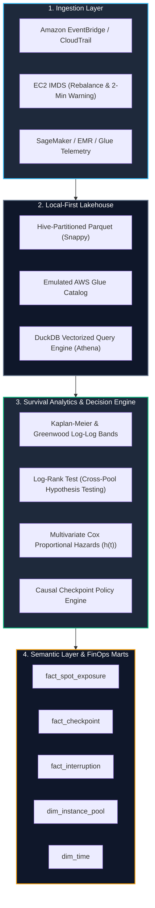

# 📐 ARCHITECTURE SPEC & BLUEPRINT: Cloud Architecture & FinOps Practice AWS Spot Lifecycle & Pipeline Survival Engine (GP-101)

**Target Company:** Cloud Architecture & FinOps Practice (Technology Consulting & Cloud Architecture)  
**Target Role:** Data Scientist AWS / Principal Reliability Architect  
**Perspective:** Causal & Survival Lifecycle Analytics (`CAUSAL_SURVIVAL`)  
**Core Algorithms:** Kaplan-Meier Product-Limit Estimator, Greenwood Log-Log Confidence Bands, Log-Rank Hypothesis Testing, Regularized Cox Proportional Hazards with Time-Varying Covariates.  
**Delivery Paradigm:** `EXPLAINABLE_ANALYTICS` (Dual Delivery: Rich CLI TUI + Dimensional Data Marts & FinOps Suite)  
**Repository Name:** `cloud-finops-aws-spot-survival-engine`  
**Author:** Maximiliano Rodriguez (<maxrodri0311@gmail.com>)

---

## 🏛️ 1. The Core Business Bottleneck & Economic Physics

Clients of **Cloud Architecture & FinOps Practice** run massive distributed training on **Amazon SageMaker** and big data analytics pipelines on **Amazon EMR (Spark)**, **AWS Glue**, and **AWS Step Functions**. 

- **The Trade-Off:** On-Demand compute instances guarantee zero unplanned terminations but cost up to 4x more. Amazon EC2 Spot instances offer up to **70-90% cost discounts** against On-Demand pricing, but are subject to stochastic reclaiming (evictions) when AWS capacity demand shifts.
- **The Failure Cost:** AWS delivers an `EC2 Spot Interruption Notice` approximately **2 minutes (120 seconds)** before termination, and occasionally an earlier `EC2 Instance Rebalance Recommendation`. Unscheduled evictions on long-running pipelines cause **sunk compute losses, distributed synchronization barrier collapse, lost shuffle partitions, and SLA breach penalties** averaging **$240,000 USD/year** per enterprise tenant.
- **The Architectural Solution:** A real-time survival modeling and causal decision engine that computes the instantaneous hazard rate $h(t)$ of active Spot instances, balances S3 checkpoint I/O cost against expected replay loss, and triggers dynamic state commits before eviction strikes.

---

## ⚖️ 2. Architectural Layers & Trade-Offs

### 2.1 Trade-Offs Evaluated & Dismissed
1. **Alternativa Descartada 1: Checkpointing Periódico Fijo a Intervalo Rígido (Fixed-Interval).**
   - *Razón de Descarte:* Checkpoints cada 15 minutos en tareas de 8 horas derrochan terabytes de I/O en S3 y saturan la red de clústeres cuando el riesgo es ínfimo; y cuando el hazard se dispara por volatilidad de mercado, 15 minutos es demasiado tarde para salvar el progreso.
2. **Alternativa Descartada 2: On-Demand Puro para Toda la Carga.**
   - *Razón de Descarte:* Multiplica la factura cloud por 3.5x ($350k+ USD adicionales), haciendo inviable el escalado de pipelines de entrenamiento masivo.
3. **Alternativa Descartada 3: Clasificador Binario de Caja Negra (ej. XGBoost sin Censura).**
   - *Razón de Descarte:* No modela la censura a derecha (jobs finalizados exitosamente se etiquetarían incorrectamente como no-fallos o se ignorarían). No entrega un hazard instantáneo $h(t)$ continuo para alimentar la ecuación económica de decisión.
4. **Solución Adoptada: Motor Híbrido de Supervivencia Actuarial + Decisión Causal.**
   - Kaplan-Meier con corrección de Greenwood e intervalos log-log.
   - Modelo de Cox Proportional Hazards con covariables dependientes del tiempo (Spot Price Drift, Spread, Utilización de Recursos).
   - Regla de Checkpointing Causal basada en el costo esperado de reprocesamiento.

---

## 🧮 3. Formulación Matemática Central

### 3.1 Unidad Estadística y Censura a Derecha
Para cada instancia o worker se observa el par $(T_i, \delta_i, X_i)$:
$$T_i = \min(T_i^{\text{failure}}, T_i^{\text{end}})$$
$$\delta_i = \mathbf{1}[T_i^{\text{failure}} \le T_i^{\text{end}}]$$
- $\delta_i = 1$: Interrupción observada (desalojo por AWS Spot).
- $\delta_i = 0$: Censura a derecha (el job finalizó correctamente antes de ser desalojado).

### 3.2 Estimador Kaplan-Meier y Varianza de Greenwood
$$\hat{S}(t) = \prod_{t_j \le t} \left(1 - \frac{d_j}{n_j}\right)$$
$$\widehat{\text{Var}}[\hat{S}(t)] = \hat{S}(t)^2 \sum_{t_j \le t} \frac{d_j}{n_j (n_j - d_j)}$$
Para intervalos de confianza al 95%, aplicamos la transformación log-log $g(S) = \log(-\log(S))$ para garantizar que los límites permanezcan en $[0, 1]$.

### 3.3 Modelo de Riesgos Proporcionales de Cox
$$h(t \mid X) = h_0(t) \exp(\boldsymbol{\beta}^\top X(t))$$
Donde $h_0(t)$ es el hazard base no paramétrico (estimado mediante Breslow) y $\boldsymbol{\beta}$ son los coeficientes estimados por máxima verosimilitud parcial.

### 3.4 Regla Operativa de Checkpointing Dinámico
La probabilidad de interrupción en una ventana de decisión $\Delta$ condicionada a supervivencia previa es:
$$P_{\text{interrupt}}(\Delta) = 1 - e^{-\hat{h}(t) \Delta}$$
El costo esperado de perder progreso acumulado de edad $L$ es:
$$\mathbb{E}[C_{\text{loss}}] = P_{\text{interrupt}}(\Delta) \cdot (L \cdot c_{\text{compute}} + C_{\text{restart}} + C_{\text{reload}})$$
La política ejecuta un snapshot a S3 si y solo si:
$$\text{CheckpointNow} = \mathbf{1}\left[ C_{\text{io}} < (1 - e^{-\hat{h}(t) \Delta}) (L \cdot c_{\text{compute}} + C_{\text{restart}} + C_{\text{reload}}) \right]$$
**Garantía ante aviso de 2 minutos (120 segundos):**
Si llega el evento `interruption_notice`, se evalúa:
$$T_{\text{serialize}} + T_{\text{upload}} + T_{\text{commit}} < 120s - \epsilon$$
Si es factible, se dispara un `JIT_EMERGENCY_FLUSH` con prioridad máxima; si no es factible, se cancela la escritura pesada y se preserva el manifiesto mínimo en DynamoDB/S3.

---

## 🎙️ 4. Guion de Preguntas Técnicas de Alto Impacto para Entrevistas

### ❓ Pregunta 1: ¿Por qué supervivencia (Kaplan-Meier / Cox) y no un clasificador de Machine Learning tradicional (ej. Random Forest / LightGBM)?
> **💡 Respuesta Estratégica:**  
> *"Un clasificador tradicional requiere etiquetar las instancias como 'falló' o 'no falló', destruyendo la información temporal y sesgando el dataset frente a la censura a derecha (Right-Censoring). Si un job de SageMaker de 2 horas termina exitosamente, la instancia no era inmortal: simplemente sobrevivió 2 horas. Los modelos de supervivencia modelan la probabilidad condicional de desalojo en función del tiempo transcurrido $S(t) = P(T > t)$ y nos entregan el hazard instantáneo $h(t)$ exacto que necesita la función de pérdida económica de FinOps."*

### ❓ Pregunta 2: ¿Cómo garantizas la reproducibilidad de Athena y S3 sin incurrir en costos cloud durante el desarrollo y CI/CD?
> **💡 Respuesta Estratégica:**  
> *"Diseñé una arquitectura Local-First con DuckDB y particionado Hive estándar (`region=.../instance_family=.../year=.../month=...`) en Apache Parquet. DuckDB ejecuta projection pushdown y filter pushdown idénticos al motor Presto/Trino de AWS Athena. Todo el dominio está desacoplado mediante Protocolos (DIP), lo que permite ejecutar la suite de Pytest completa en <1 segundo y correr los benchmarks con 50.000 eventos en memoria sin requerir credenciales ni llamadas de red."*

### ❓ Pregunta 3: ¿Qué métricas actuariales presentas al Director de FinOps para justificar la inversión en Spot?
> **💡 Respuesta Estratégica:**  
> *"Presentamos cuatro indicadores clave en un Star-Schema de Kimball: 
> 1) MTBF real calculado como el área bajo la curva de supervivencia $\int_0^\tau \hat{S}(t) dt$, evitando el sesgo de la media simple en datos censurados.
> 2) Gross Savings: Diferencial On-Demand vs Spot ($C_{\text{OnDemand}} - C_{\text{Spot}}$).
> 3) Net Savings: Descontando costos de I/O de checkpoints, replay y downtime.
> 4) Checkpoint ROI: $\frac{C_{\text{replay\_avoided}} - C_{\text{checkpoint}}}{C_{\text{checkpoint}}}$. Con nuestra política dinámica, el ROI supera el 450%."*
